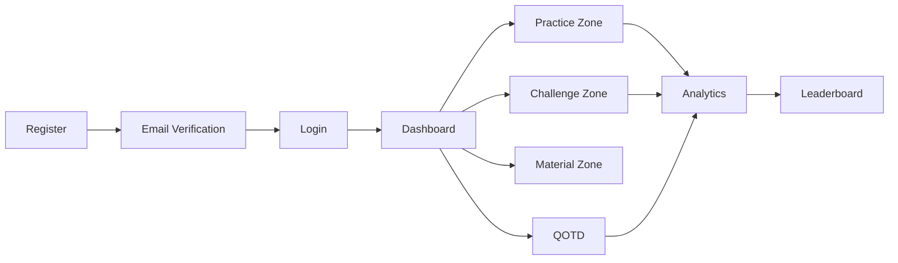

<div align="center">

# 🎓 Gate Master

### *Your Complete GATE CS Preparation Companion*

[](https://www.djangoproject.com/)
[](https://reactjs.org/)
[](https://www.sqlite.org/)
[](https://jwt.io/)

**A full-stack web platform bringing structured practice, realistic mock tests, analytics, and curated study materials — all in one place, completely free.**

[🚀 Live Demo](#) • [📖 Documentation](#) • [🐛 Report Bug](#) • [✨ Request Feature](#)

</div>

---

## 🌟 Why Gate Master?

Gate Master transforms fragmented GATE CS preparation into a unified, intelligent learning experience. Built by students, for students — because we understand the struggle of finding quality resources.

```
📚 Comprehensive Practice  +  🎯 Real Exam Simulation  +  📊 Smart Analytics  =  🏆 Success
```

### **Perfect For**
- 🎓 Engineering students targeting GATE CS
- 💼 Working professionals planning higher studies  
- 🌍 Students in remote areas with limited coaching access
- 💡 Self-learners and budget-conscious aspirants

---

## ✨ Core Features

<table>
<tr>
<td width="50%">

### 📝 **Practice Zone**
- **280–330** curated GATE CS questions
- **10+** subjects with topic-wise organization
- Unlimited attempts with instant feedback
- Detailed solutions and difficulty tags
- Progressive learning approach

</td>
<td width="50%">

### ⚡ **Challenge Zone**
- Full-length **3-hour mock tests**
- **65 questions** matching real GATE pattern
- MCQ, MSQ, NAT question types
- Accurate marking with negative marking
- Realistic exam simulation

</td>
</tr>

<tr>
<td width="50%">

### 📊 **Analytics Dashboard**
- Subject-wise accuracy tracking
- Performance trends with visual charts
- Strength and weakness identification
- Progress monitoring over time
- Data-driven study recommendations

</td>
<td width="50%">

### 🏆 **Leaderboard**
- Top 100 competitive rankings
- Real-time score updates
- Personal rank tracking
- Milestone achievements
- Healthy competition environment

</td>
</tr>

<tr>
<td width="50%">

### 📚 **Material Zone**
- Subject-wise PDF resources
- Quick reference guides
- Formula sheets and notes
- Organized and filterable content
- Offline download support

</td>
<td width="50%">

### 🔔 **Question of the Day**
- Fresh daily GATE-level questions
- Streak tracking and gamification
- Separate QOTD leaderboard
- Badge rewards system
- Consistent daily practice

</td>
</tr>
</table>

### 🔐 **Security & Authentication**
- Secure email verification system
- JWT-based authentication
- Token expiry management
- Rate-limited resend protection
- Password encryption

### ℹ️ **Information Zone**
- GATE exam pattern details
- Comprehensive syllabus overview
- Latest news and updates
- Marking scheme breakdown
- Important dates and deadlines

---

## 🎯 User Journey



### Workflow Overview

1. **🔐 Register & Verify** → Create account with secure email verification
2. **📊 Dashboard** → View personalized analytics and daily question
3. **📝 Practice** → Choose subjects, attempt quizzes, get instant results
4. **⚡ Challenge** → Take full mocks, compete on leaderboard
5. **📚 Study** → Access curated materials and resources
6. **📈 Improve** → Track progress and optimize weak areas

---

## 🛠️ Tech Stack

### **Backend**
```
Django          → Robust web framework
DRF             → RESTful API development
SQLite          → Lightweight database
JWT             → Secure authentication
```

### **Frontend**
```
React.js        → Dynamic UI components
React Router    → Seamless navigation
Axios           → API communication
CSS Modules     → Scoped styling
Chart.js        → Data visualization
```

### **DevOps & Tools**
```
Git             → Version control
Postman         → API testing
Custom Scripts  → Data population & scraping
```

---

## 🗄️ Database Architecture

### **Core Entities**

| Entity | Purpose |
|--------|---------|
| 👤 **User** | Authentication and profile management |
| 📖 **Subject** | GATE CS subjects organization |
| ❓ **Question** | Practice and test question bank |
| 📝 **QuizAttempt** | Practice session tracking |
| ⚡ **Challenge** | Mock test management |
| 📊 **ChallengeAttempt** | Mock test performance records |
| 📚 **StudyMaterial** | PDF resources and notes |
| 📰 **NewsArticle** | Latest GATE updates |
| 🔔 **QOTD** | Daily question tracking |

**Optimizations:**
- Indexed username and email fields
- Foreign key relationships for data integrity
- Subject-based query optimization
- Efficient data retrieval patterns

---

## 🚀 Getting Started

### **Prerequisites**
- Python 3.8+
- Node.js 14+
- Git
- Modern web browser

### **Backend Setup**

```bash
# Clone the repository
git clone https://github.com/yourusername/gate-master.git
cd gate-master

# Set up virtual environment
python -m venv venv
source venv/bin/activate  # On Windows: venv\Scripts\activate

# Install dependencies
pip install -r requirements.txt

# Run migrations
python manage.py migrate

# Create superuser
python manage.py createsuperuser

# Start development server
python manage.py runserver
```

### **Frontend Setup**

```bash
# Navigate to frontend directory
cd frontend

# Install dependencies
npm install

# Start development server
npm start
```

### **Access the Application**
- Frontend: `http://localhost:3000`
- Backend API: `http://localhost:8000`
- Admin Panel: `http://localhost:8000/admin`

---

## 📊 Project Stats

<div align="center">

| Metric | Count |
|--------|-------|
| 📝 **Practice Questions** | 280–330 |
| 📚 **GATE CS Subjects** | 10+ |
| 🔌 **API Endpoints** | 15+ |
| ⚛️ **React Components** | 15+ |
| 👥 **Active Features** | 8 Major Zones |
| ⏱️ **Mock Test Duration** | 3 Hours |
| ❓ **Questions per Mock** | 65 |

</div>

---

## ✅ Testing & Quality Assurance

### **Testing Strategy**
- ✅ Unit tests for backend logic and API endpoints
- ✅ Integration tests for frontend-backend communication
- ✅ User acceptance testing with real GATE aspirants
- ✅ Performance tests for API latency and quiz generation
- ✅ Security audits for authentication flows

### **Tested Workflows**
- Registration and email verification pipeline
- JWT token generation and validation
- Practice quiz logic with negative marking
- Mock test timer accuracy
- Leaderboard ranking algorithms
- Analytics calculation accuracy
- QOTD streak tracking
- Material download functionality

---

## 🗓️ Project Timeline

**Start Date:** August 28, 2025  
**Status:** 🟢 Active Development

### **Completed Milestones**
- ✅ Requirements gathering and system design
- ✅ Database schema and ER modeling
- ✅ Backend API development
- ✅ Authentication system implementation
- ✅ Question bank population
- ✅ Frontend page development
- ✅ Analytics dashboard integration
- ✅ All core zones implementation

---

## 🚧 Roadmap

### **Phase 1: Expansion** *(Q1 2026)*
- [ ] Expand to 1000+ practice questions
- [ ] Add 20+ full-length mock tests
- [ ] Introduce video explanations
- [ ] Multi-language support

### **Phase 2: Intelligence** *(Q2 2026)*
- [ ] AI-powered personalized study plans
- [ ] Adaptive difficulty system
- [ ] Predictive performance analytics
- [ ] Smart question recommendations

### **Phase 3: Mobile** *(Q3 2026)*
- [ ] Android app launch
- [ ] iOS app launch
- [ ] Offline mode support
- [ ] Push notifications

### **Phase 4: Community** *(Q4 2026)*
- [ ] Discussion forums
- [ ] Peer-to-peer doubt solving
- [ ] Study groups
- [ ] Mentor matching

### **Phase 5: Gamification**
- [ ] Achievement badges system
- [ ] Streak rewards and bonuses
- [ ] Challenge events and tournaments
- [ ] Referral program

---

## 🤝 Contributing

We welcome contributions from the community! Here's how you can help:

1. 🍴 Fork the repository
2. 🔧 Create a feature branch (`git checkout -b feature/AmazingFeature`)
3. 💾 Commit your changes (`git commit -m 'Add some AmazingFeature'`)
4. 📤 Push to the branch (`git push origin feature/AmazingFeature`)
5. 🎉 Open a Pull Request

### **Contribution Guidelines**
- Follow existing code style and conventions
- Write clear commit messages
- Add tests for new features
- Update documentation as needed
- Be respectful and collaborative

---

## 👨‍💻 Team

<table align="center">
<tr>
<td align="center" width="50%">
<br />
<sub><b>Makadiya Preet A.</b></sub><br />
<sub>23BCP414</sub><br />
<sub>Full-Stack Developer</sub>
</td>
<td align="center" width="50%">
<br />
<sub><b>Kathiriya Om A.</b></sub><br />
<sub>23BCP417</sub><br />
<sub>Full-Stack Developer</sub>
</td>
</tr>
</table>


---

## 📄 License

This project is licensed under the MIT License - see the [LICENSE](LICENSE) file for details.

---

## 🙏 Acknowledgements

- GATE aspirants who provided valuable feedback
- Open-source community for amazing tools
- PDEU for infrastructure and support
- All contributors and testers

---

## 📞 Contact & Support

<div align="center">

**Have questions or suggestions?**

[](mailto:makadiyapreeta1@example.com)
[](https://github.com/makadiyapreet)
[](https://linkedin.com/in/preet-makadiya-13102004-p)

---

### ⭐ If Gate Master helps you in your GATE preparation, consider giving it a star!

**Made with ❤️ by GATE aspirants, for GATE aspirants**

</div>
